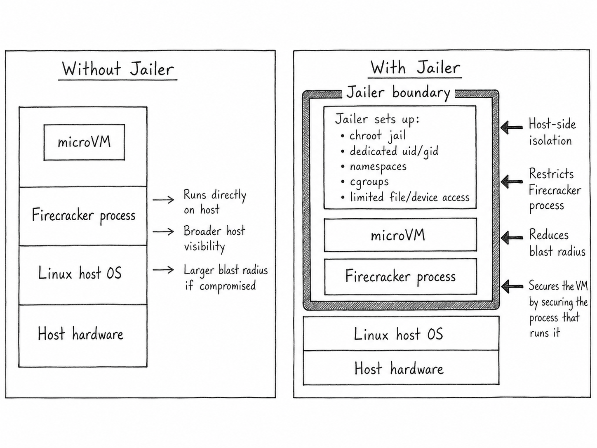

# cracker-sdk

`cracker-sdk` is a small Python wrapper around the Firecracker runtime API that helps you run microVMs efficiently from Python.

`NOTE:` This SDK supports Linux environments alone, because Linux is what powers 90% of cloud platforms. You can’t run this on Mac or Windows. This SDK will be used to deploy and manage your VM efficiently with a high-level API in Python.

If you are new to this topic, check my blog post:
[Behind Serverless Functions: Firecracker KVM and Linux](https://medium.com/@prasannajaga9/behind-serverless-functions-firecracker-kvm-and-linux-979aa1862c3f)

Before we start implementing, make sure all the required binaries are available in your system using:

```python
response = crackerVM.checkIfExist()

# Expected response
{
    "firecracker": "OK" | "MISSING,
    "jailer": "OK",
    "KVM": "OK"
}
```

you can find more real world usecase here:

- [Exec Sandboxing](examples_usecases/exec_sandboxing/README.md)
- [Isolated Python Job Runner](examples_usecases/isolated_python_job_runner/README.md)
- [Memory Governed Workers](examples_usecases/memory_governed_workers/README.md)
- [SSH Sandbox](examples_usecases/ssh_sandbox/README.md)
- [Warm Snapshot Pool](examples_usecases/warm_snapshot_pool/README.md)

## QuickStart examples

In this example, we use Firecracker directly without the jailer implementation. This demonstrates how quickly you can spin up a microVM using `cracker-sdk`.

Before creating your `CrackerVM` object, make sure all the required binaries are available in your system using:

```python
response = crackerVM.checkIfExist()

# Expected response
{
    "firecracker": "OK",
    "jailer": "OK",
    "KVM": "OK"
}
```

```python
from crackersdk import crackerVM

BOOT_ARGS = "console=ttyS0 reboot=k panic=1 pci=off root=/dev/vda rw init=/init"

crackerVM.checkIfExist()

vm = crackerVM(
    binary="/home/user/.local/bin/firecracker",
    socket_path="/tmp/cracker-sdk.sock",
    log_path="/tmp/cracker-sdk.log",
    kernel_path="/home/user/images/vmlinux",
    rootfs_path="examples/rootfs/hello/rootfs.ext4",
    boot_args=BOOT_ARGS,
)

result = vm.run(vcpu_count=1, mem_size_mib=256, timeout=30)
print("response", result.stdout)
```

use the explicit lifecycle methods when you need full control over the boot sequence or want to configure devices step by step.

```python
from crackersdk import crackerVM

BOOT_ARGS = "console=ttyS0 reboot=k panic=1 pci=off root=/dev/vda rw init=/init"

crackerVM.checkIfExist()

vm = crackerVM(
    binary="/home/user/.local/bin/firecracker",
    socket_path="/tmp/cracker-sdk-low-level.sock",
    log_path="/tmp/cracker-sdk-low-level.log",
)

try:
    vm.start()
    vm.wait_until_ready()
    vm.configure_logger("/tmp/cracker-sdk-low-level.log")

    vm.machine(vcpu_count=2, mem_size_mib=512)
    vm.boot_source(
        kernel_image_path="/home/user/images/vmlinux",
        boot_args=BOOT_ARGS,
    )
    vm.root_drive(path="examples/rootfs/hello/rootfs.ext4")
    vm.entropy()

    vm.boot()
    exit_code = vm.wait(timeout=30)
    print("exit_code:", exit_code)
finally:
    vm.stop()
```

## Features

`Snapshots & Restore` help when the normal boot path is still too slow for your workload.
Instead of rebuilding the same guest state every time, you can boot a VM once, let it finish its setup work, pause it, and save both the VM state and memory to disk. Later, a new VM can restore from those files and continue from that saved point.
The snapshot file stores the device and VM state, while the memory file stores guest RAM. Keep both files together and restore them with the same kernel/rootfs assumptions you used when creating the snapshot  

```python
from crackersdk import CrackerVM

FC_BINARY = "/home/user/.local/bin/firecracker"
SOURCE_SOCKET = "/tmp/cracker-sdk-source.sock"
RESTORED_SOCKET = "/tmp/cracker-sdk-restored.sock"
SNAPSHOT_PATH = "/tmp/cracker-sdk.snapshot"
MEM_FILE_PATH = "/tmp/cracker-sdk.mem"

CrackerVM.checkIfExist()

# Start and configure source_vm before snapshotting it.
source_vm = CrackerVM(binary=FC_BINARY, socket_path=SOURCE_SOCKET)

source_vm.pause(strict=True)
snapshot = source_vm.create_snapshot(
    snapshot_path=SNAPSHOT_PATH,
    mem_file_path=MEM_FILE_PATH,
    overwrite=True,
)
source_vm.stop()

# Resume from snapshot instantly
restored_vm = CrackerVM(binary=FC_BINARY, socket_path=RESTORED_SOCKET)
restored_vm.restore(
    snapshot_path=snapshot.snapshot_path,
    mem_file_path=snapshot.mem_file_path,
    resume=True,
)
print("Restored VM Status:", restored_vm.status())

```

`Dynamic Memory Ballooning` lets the host reclaim memory from a guest VM without stopping it.
Firecracker exposes this through a virtio-balloon device: when the balloon grows, the guest gives memory back to the host; when it shrinks, the guest gets more memory again.

In practice this is handy when you run many microVMs on the same machine. Some guests sit mostly idle while others are busy, and ballooning gives you a way to shift memory around instead of reserving the worst-case amount for every VM. You can control the balloon manually, or use a `BalloonPolicy` so the SDK adjusts it in the background based on host memory pressure.

```python
from crackersdk import BalloonPolicy, CrackerVM

BOOT_ARGS = "console=ttyS0 reboot=k panic=1 pci=off root=/dev/vda rw init=/init"

CrackerVM.checkIfExist()

policy = BalloonPolicy(
    min_balloon_mib=64,
    max_balloon_mib=768,
    step_mib=128,
    low_available_mib=2048,
    high_available_mib=8192,
    cooldown_seconds=5.0,
)

vm = CrackerVM(
    binary="/home/user/.local/bin/firecracker",
    socket_path="/tmp/cracker-sdk-balloon.sock",
    log_path="/tmp/cracker-sdk-balloon.log",
    kernel_path="/home/user/images/vmlinux",
    rootfs_path="examples/rootfs/longrun/rootfs.ext4",
    boot_args=BOOT_ARGS,
    optimize_memory=True,
    memory_policy=policy,
)

```

By setting `optimize_memory=True`, the SDK configures a virtio-balloon device before boot and starts the background memory optimizer when the VM boots.

`Tunneling with Vsock` gives you a simple private channel between the host and the guest.
It is useful when you want request/response communication without creating a tap device, assigning IPs, or exposing a TCP port. The host talks to a Unix socket, and Firecracker forwards that traffic to a vsock port inside the guest.

This works well for small control APIs, health checks, bootstrap messages, or moving data between the host and a jailed VM. Your guest still needs a listener on the vsock port you choose.

```python
from crackersdk import VsockClient, crackerVM

VSOCK_PATH = "/tmp/cracker-sdk-vsock.sock"

crackerVM.checkIfExist()

vm = crackerVM(
    binary="/home/user/.local/bin/firecracker",
    socket_path="/tmp/cracker-sdk.sock",
    log_path="/tmp/cracker-sdk.log",
)

vm.start()
vm.wait_until_ready()
print("vsock:", vm.vsock(guest_cid=3, uds_path=VSOCK_PATH))

# Requires a guest listener on vsock port 5000.
print("response:", VsockClient(VSOCK_PATH).request(port=5000, data=b"ping"))
```

`Networking` adds tap devices to give the VM internet/network access.

```python

NETWORK = {
    "iface_id": "eth0",
    "host_dev_name": "tap0",
    "guest_mac": "AA:FC:00:00:00:01",
}

vm.network(**NETWORK)

```

## Jailer Secure implementation

If the VM gets compromised, there is a chance it could access host machine data and secrets. To reduce this risk, we use the jailer to isolate the guest from the host and provide an additional security boundary.

The jailer restricts what the guest can access on the host system, helping protect sensitive files and resources even if something inside the VM is compromised.



You can optionally set a global jailer root:

```bash
export JAILER_ROOT=/tmp/cracker-jailer
```

`JailerConfig.chroot_base_dir` controls where jail directories are created. If `JAILER_ROOT` is set in the process environment, the SDK uses that value instead of `chroot_base_dir`.

you can implement jailer using this simple example

```python
from crackersdk import CrackerVM, Jailer, JailerConfig

vm = CrackerVM(
    binary=FC_BINARY,
    socket_path=SOCKET_PATH,
    kernel_path=KERNEL_PATH,
    rootfs_path=ROOTFS_PATH,
    boot_args=BOOT_ARGS,
    workdir=WORKDIR,
)

jailed = Jailer(
    vm,
    config=JailerConfig(
        jailer_binary=JAILER_BINARY,
        jail_id=JAIL_ID,
        uid=JAILER_UID,
        gid=JAILER_GID,
        chroot_base_dir=JAILER_CHROOT_BASE,
    ),
) 
result = jailed.run(timeout=5)
```

If you want more granular control, use the jailer as a context manager:

```python
import time

from crackersdk import CrackerVM, Jailer, JailerConfig, VsockClient

BOOT_ARGS = "console=ttyS0 reboot=k panic=1 pci=off root=/dev/vda rw init=/init"
FC_BINARY = "/home/user/.local/bin/firecracker"
JAILER_BINARY = "/home/user/.local/bin/jailer"
KERNEL_PATH = "/home/user/images/vmlinux"
ROOTFS_PATH = "examples/rootfs/vsock/rootfs.ext4"
SOCKET_PATH = "/tmp/cracker-sdk-jailer.sock"
WORKDIR = "/tmp/cracker-sdk-jailer"
JAIL_ID = "cracker-sdk-vsock"
JAILER_UID = 1000
JAILER_GID = 1000
JAILER_CHROOT_BASE = "/tmp/cracker-jailer"

vm = CrackerVM(
    binary=FC_BINARY,
    socket_path=SOCKET_PATH,
    kernel_path=KERNEL_PATH,
    rootfs_path=ROOTFS_PATH,
    boot_args=BOOT_ARGS,
    workdir=WORKDIR,
)

config = JailerConfig(
    jailer_binary=JAILER_BINARY,
    jail_id=JAIL_ID,
    uid=JAILER_UID,
    gid=JAILER_GID,
    chroot_base_dir=JAILER_CHROOT_BASE,
)

with Jailer(vm, config) as jailer:
    jailer.start()
    jailer.wait_until_ready()
    jailer.machine(vcpu_count=1, mem_size_mib=256)
    jailer.configure_logger(log_path=jailer.log_path)
    jailer.boot_source(kernel_image_path=jailer.kernel_path, boot_args=BOOT_ARGS)
    jailer.root_drive(path=jailer.rootfs_path)
    jailer.entropy()
    jailer.vsock(guest_cid=3, uds_path="/run/vm.vsock")
    jailer.boot()
    print("host_vsock_path:", jailer.host_vsock_path)
    time.sleep(5)
    if jailer.host_vsock_path is None:
        raise RuntimeError("Vsock host path was not configured")
    print("response:", VsockClient(jailer.host_vsock_path).request(port=5000, data=b"ping"))
    print(jailer.status())

```
